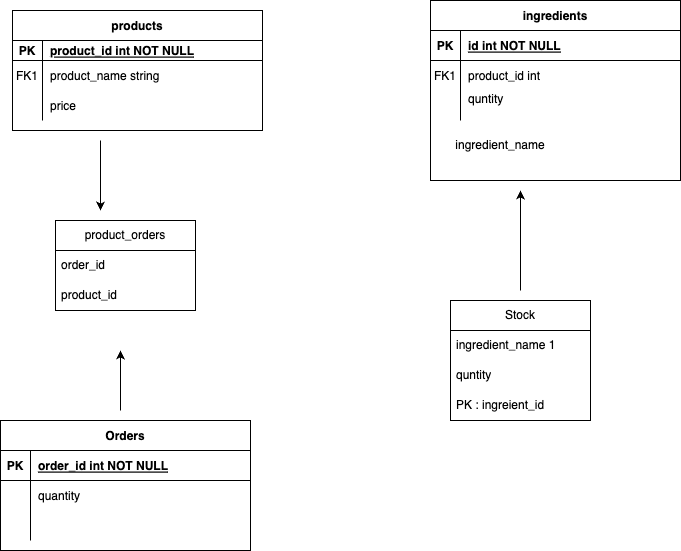

# Order managment Project

# my work during the Task:

- First I created my OWN docker and docker-compose to set the initals for the task. you could find the used stack with its corresponding version later on.
- Second I created the migration and wrote some seed and Factories for it.
  

- Third  I used the Hexagonal Architecture for the task

Also, you will find that I didn't use any external packages like "modules".

you would find the whole service inside Order service which will 
contain [DTO - Factories - Providers - Repositories - Requests - Services]

I totally depend on Query builder.

I used Redis as stock save for the inital values you mentioned

# The Request Life Cycle through the Structure
- Validation 
- controller
- create DTO through Factory
- Service [handle the logic - call repository - call Redis to check the stock quantities and sent email - dispatch the job to send email ]
- Repository(Query builder).

# My development Environment
- PHP 8.1
- Mysql 8.0
- Nginx
- Redis

# installation:

For Interactive mode :

`docker-compose up --build`

for detached mode:

`docker-compose up -d --build`

You could check installation through this URL

`http://localhost:8000/`

You could see fresh installation of laravel application.

**DON't Forget to change your .env credentials like [.env.example] to its corresponding values at docker-compse.yml file.**

after finishing every steps
- to run command inside container
`docker exec -it php81-container /bin/bash`

- run migration
`php artisan migrate`

- seed Database
`php artisan db:seed`

- cache the stock in Redis
`php artisan cache:stock`

NOW everything is running Smoothly - check endpoints

### Developed APIS

| Method   | URL                  | Description                            |
|----------|----------------------|----------------------------------------|
| `POST`    | `/api/orders`        | add Order and deduct from stock               | |

## for running test:

- please enter the container by `docker exec -it php81-container /bin/bash`

- To run feature Test =>`./vendor/bin/phpunit ` OR `php artisan test`

